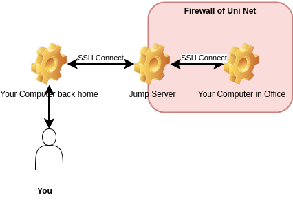

## Remote connect your Uni PC (Server) from one exist Computer outside of University with JumpServer (Client)

<div style="text-align: center;">
    
</div>

### 1. Get one Account of a JumpServer from [Simon Triphan](simon.triphan@med.uni-heidelberg.de).
First of all, you should ask Simon to creat you an account of JumpServer, since you can't get access to the University Network directly because of the firewall. JumpServer is one bridge between the outside Coputer and the Uninet Computer. After you got the account information of the JumpServer, you should be able to connect the JumpServer from one Computer outside. From now on, we will call the JumpServer <mark>Client</mark>, and the Uni PC <mark>Server<mark>.

The default authentication way is username and password. Notice: 3 times wrong password means that the ip address will be locked. Then you should go to Simon to ask him unlock your ip.

### 2. Configuration of the SSH 
#### 2.1. Client side (JumpServer)
All the command under this section must be run into the JumpServer Terminal.

##### 2.1.1. Generate the ssh-key
If you don't have private Key and public Key yet, they should be created with 

```
ssh-keygen -t rsa -b 4096
```
The generated files will be default saved under `~/.ssh` directory. The default name of public key is `id_rsa`, and the public key is `id_rsa.pub`. 

##### 2.1.2. Transfer the public key from Client to Server
If you're using the ||`ssh-copy-id` utility, it will automatically create the `authorized_keys` file in the Server side.
```
ssh-copy-id username@server_ip_address
```
Or you can also get the content manually
```
cat ~/.ssh/id_rsa.pub
```
copy and past the output into the `~/.ssh/authorized_keys` on Server side.

##### 2.1.3. Configuration of SSH
After Generation of ssh-key, you should creat the configuration file under the ssh key directory
```
touch ~/.ssh/config
```
and then edit the config file with editor like vim or nano. Get into the config, and then configure the file exactly in this format
```
Host myworkcomputer
    User username
    HostName 129.206.00.000
    PreferredAuthentications publickey
    IdentityFile ~/.ssh/id_rsa
    Port 22
```
These are the explain:
a. Host: this is an alias of your Server. Here my Host is `myworkcomputer`, which means as you want to connect the Server, you should use this command `ssh myworkcomputer`. This value can be defined as you want.
b. User: this should be followed by the username of your Server.
c. HostName: this parameter should be followed by the external IP Address of the Server. You can get it with this command: `curl https://ipinfo.io/ip` on your Server.
d. PreferredAuthentications: That's always same as in the templet.
e. IdentityFile: this is the path, where you saved your ssh-privatkey.
f. Port: the default value here is 22. You don't need this parameter if you don't want to change the port.

#### 2.2. Server side
##### 2.2.1. Install the necessary packages and start ssh-server
1. you need to install related packages and also ssh server
```
apt install openssl-server
```
2. Start and Enable the ssh service
```
sudo systemctl start ssh
sudo systemctl enable ssh
```
3. Check ssh status
```
sudo systemctl status ssh
```
Your ssh should be aktiv now.
4. Configuration of Firewall
```
sudo ufw allow ssh
```
##### 2.2.2. Configuration of ssh-server
a. Open the file `authorized_keys` under `~/.ssh`. If you don't have this file, then creat one. Open this file, and go bact to the client, find the public key, copy the content of the public key from client into this file. (see 2.1.1)

b. Edit SSH Config file. Open it with
```
nano /etc/ssh/sshd_config
```
Ensure that the following directives are set (uncomment them if necessary and set their values):
```
PubkeyAuthentication yes
PermitRootLogin no
```
c. Restart the ssh
```
sudo systemctl restart ssh
```
### 3. Connection

from the Computer outside, you should first get into the Client (JumpServer)
```
ssh usernameOfJumpServer@ipaddressOfJumpServer
```
Then in Terminal of the Client, use Commandline to connect your university computer.
```
ssh myworkcomputer
```

That's all, you can access your university Computer from any other (except the clinical) PC now.
